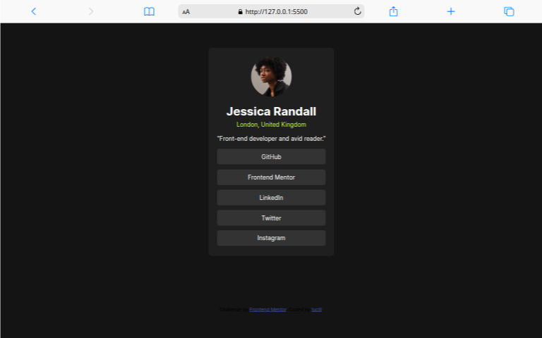

# Frontend Mentor - Social links profile solution

This is a solution to the [Social links profile challenge on Frontend Mentor](https://www.frontendmentor.io/challenges/social-links-profile-UG32l9m6dQ). Frontend Mentor challenges help you improve your coding skills by building realistic projects.

## Table of contents

- [Overview](#overview)
  - [The challenge](#the-challenge)
  - [Screenshot](#screenshot)
  - [Links](#links)
- [My process](#my-process)
  - [Built with](#built-with)
  - [What I learned](#what-i-learned)
  - [Continued development](#continued-development)
  - [Useful resources](#useful-resources)
- [Author](#author)
- [Acknowledgments](#acknowledgments)

## Overview

### The challenge

Users should be able to:

- See hover and focus states for all interactive elements on the page

### Screenshot




### Links

- Solution URL: [Add solution URL here](https://www.frontendmentor.io/profile/tucill/solutions)
- Live Site URL: [Add live site URL here](https://tucill.github.io/social-profile/)

## My process

I worked on the html part first and then set the styles.

### Built with

- Semantic HTML5 markup
- CSS custom properties
- Flexbox
- CSS Grid

### What I learned

Use this section to recap over some of your major learnings while working through this project. Writing these out and providing code samples of areas you want to highlight is a great way to reinforce your own knowledge.

To see how you can add code snippets, see below:

```html
<h1>Hi I'am tucill</h1>
```

```css
.card {
  display: flex;
}
```

```js
const sayHello = () => {
  console.log("Hi I'am tucill");
};
```

### Continued development

In the future, I want to be more exprerienced and also be skilled at creating responsive, interactive and beautiful weeb display

### Useful resources

- [Example resource 1](https://www.w3schools.com) - Helped me learn about creating web

## Author

- Website - [Add your name here](https://tucill.github.io/social-profile/)
- Frontend Mentor - [@yourusername](https://www.frontendmentor.io/profile/tucill)
- Instagram - [@tucill.xyz](https://www.instagram.com/tucill.xyz)

## Acknowledgments

Thank you, Frontend Mentor, for providing an amazing platform that has helped me learn and improve my frontend development skills. Each challenge is incredibly valuable and has taugh me best practices in web development. Thank you for fostering such a supportive and inspiring community!
